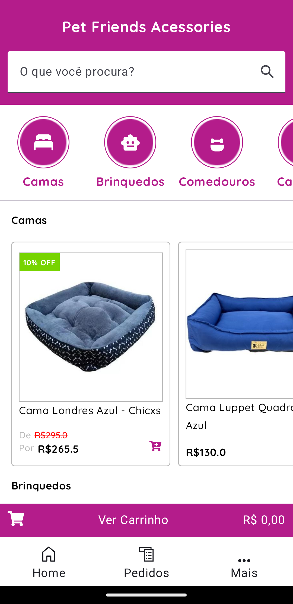

# Lojinha Virtual

A lojinha virtual é um aplicativo Android construído com: 
- Linguagem Kotlin 
- Jetpack Compose, recomendado para UI Nativas
- Retrofit, Biblioteca recomendanda pela Google para consumos de API´s
- GSON, Biblioteca da Google para lidar com dados no formato JSON
- Coroutines, para executar código de forma assíncrona(utilizei no consumo da API)
- LiveData, para observar os dados
- Koin, para injetar dependências
- Coil, para carregar imagens a partir de URL´s
- Arquitetura MVVM, Model View ViewModel
- Clean Code

### Por quê foi construido?

A lojinha virtual foi contruida para atender a necessidade de um cliente que já poussía um sistema para cadastro de itens, porém precisava de um produto para atender seu consumidor final, o aplicativo visa suprir essa finalidade. O projeto está na fase inicial portanto se trata de um protótipo com poucas funcionalidades e somente duas telas e necessita da aprovação do cliente para a evolução do produto em questão.

### A origem de dados utilizada foi um mock criado no site [mockapi.io](https://mockapi.io)
🔗 [Lista de categorias e seus respectivos produtos](https://64e40f04bac46e480e795ada.mockapi.io/api/lojinhavirtual/categorias)
        
## Demonstração

  &nbsp; &nbsp; &nbsp; &nbsp;

